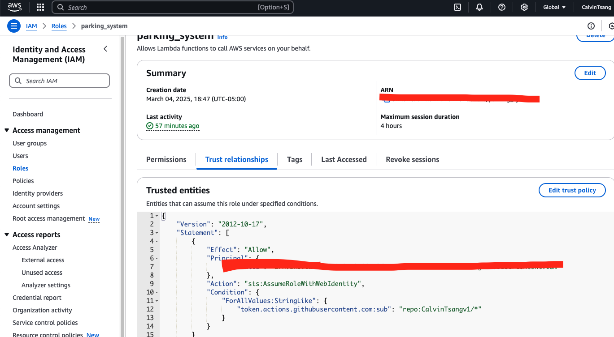
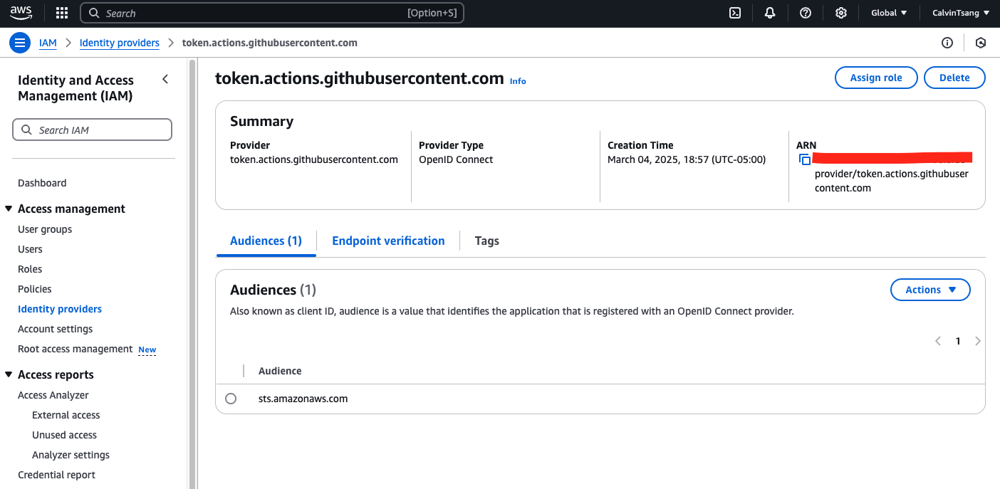

# parking_system_deployment

## Overview
A serverless REST API for managing parking ticket using AWS services.

## Features
- Create Parking Ticket
- Read Parking Ticket
- List Parking Tickets
- Update Parking Ticket Information
- Delete Parking Ticket

## Architecture
- AWS API Gateway
- AWS API Gateway
- AWS Lambda Functions
- DynamoDB for data storage
- Serverless Framework for infrastructure
- Node.js with TypeScript

## Prerequisites
- AWS Account
- Node.js 18.x
- Serverless Framework
- AWS CLI configured

## AWS Deployment Setup
1. Create IAM Role first with customized name
2. Apply Permission policies (DynmoDB, API Gateway, CloudFormation, S3)
3. Find Identity Provider from left side bar in IAM Page, and then create customized provider,and then add audiences "sts.amazonaws.com".
3. After that, switch to Roles category, and then edit Trust relationships in new role which OIDC Provider (Action: sts:AssumeRoleWithWebIdentity)
4. Your customized IAM Role ARN code can copy to Git Action secret key environment.
5. According to your Role ARN, it can access services via the entry.




## Local Development Setup and Testing
1. Clone repository
2. npm install
3. npm run deploy:dev

## Running Tests
```npm test```

## Deployment
- Development: npm run deploy:dev
- Production: npm run deploy:prod

## Challenge
1. AWS IAM access environment have to setup on my own
2. Issue with Truest Relationships entity which always got error from action:"AssumeRoleWithWebIdentity", have to understand well with configuration settings
3. Manually setup S3, DynamoDB, CloudFormation, sometimes got stuck with rollback issue and restart issue.
4. Hard to track if AWS environment has problem, not much information from GitAction pipeline

## Improvement
1. From IAC concept, I have to use Terraform to complete all section from AWS setup and GitAction CI/CD pipeline integration.
2. GitAction secret key or variable environment setting has to be clear, using specific keyword "dev", "prod"
3. GitHub Branch Access and then Branch Pull Request have to set permission and reviewer for each pull request, make sure all pull request is valid and meet the quality.