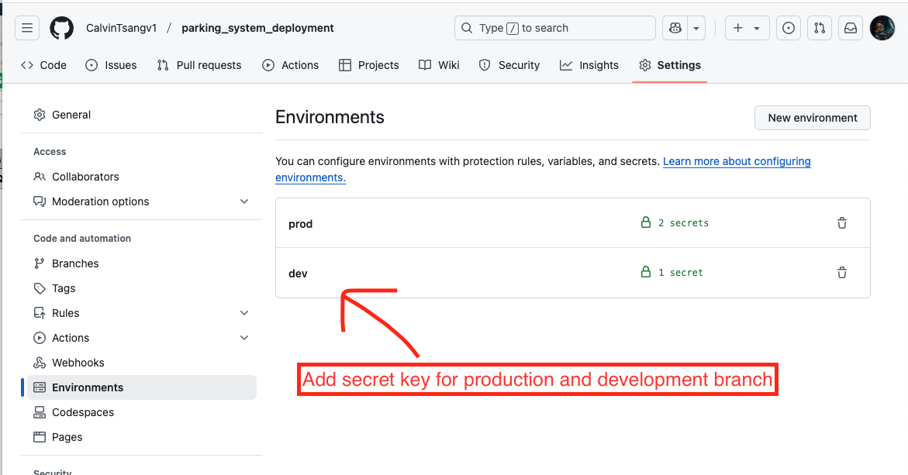

# parking_system_deployment

## Overview
A serverless REST API for managing parking ticket using AWS services.

## Features
- Create Parking Ticket:
    The feature which create parking ticket with vehicle information, and get to know the number of occupied parking spot.
- Read Parking Ticket:
    The feature which get detials about active or past parking record and vehicle details.
- List Parking Tickets:
    The feature which get list of the details of parking record and vehicle details for month-end or reporting.
- Update Parking Ticket Information:
    The feature which update parking record details and also update vehicle information to be exisitng regular customer.
- Delete Parking Ticket:
    The feature which soft delete a parking record from the database for some reason.

## Architecture
- AWS API Gateway
- AWS API Gateway
- AWS Lambda Functions
- DynamoDB for data storage
- Serverless Framework for infrastructure
- Node.js with TypeScript

## Prerequisites
- AWS Account
- Node.js 18.x
- Serverless Framework
- AWS CLI configured

## AWS Deployment Setup
1. Create IAM Role first with customized name
2. Apply Permission policies (DynmoDB, API Gateway, CloudFormation, S3)
3. Find Identity Provider from left side bar in IAM Page, and then create customized provider,and then add audiences "sts.amazonaws.com".
3. After that, switch to Roles category, and then edit Trust relationships in new role which OIDC Provider (Action: sts:AssumeRoleWithWebIdentity)
4. Your customized IAM Role ARN code can copy to Git Action secret key environment.
5. According to your Role ARN, it can access services via the entry.


## GitHub Environment Variable Setting


## Local Development Setup and Testing
1. Clone repository
2. npm install
3. npm run deploy:dev

## Running Tests
```npm test```

## Deployment
- Development: npm run deploy:dev
- Production: npm run deploy:prod

### AWS Services Manual Setup Challenges
1. AWS IAM access environment have to setup on my own
2. Issue with Trust Relationships entity which always got error from action:"AssumeRoleWithWebIdentity", have to understand well with configuration settings
3. Manually setup S3, DynamoDB, CloudFormation, sometimes got stuck with rollback issue and restart issue
4. Hard to track if AWS environment has problem, not much information from GitAction pipeline
5. CloudWatch Logs configuration required manual intervention to set proper retention periods
6. API Gateway throttling settings needed manual configuration for proper rate limiting
7. Lambda cold start issues in production environment required manual configuration of provisioned concurrency

### IAM Problems in Detail
1. **OIDC Provider Configuration**: Incorrect audience configuration caused authentication failures
2. **IAM Policy Permissions**: Initial policy was too restrictive, preventing Lambda from accessing DynamoDB
3. **Cross-Account Access**: Encountered issues when trying to deploy from one AWS account to resources in another
4. **Role Assumption**: GitHub Actions needed specific permissions to assume the IAM role correctly
5. **Least Privilege Implementation**: Difficulty in determining the minimum set of permissions needed for deployment

## Improvements
1. From IAC concept, I have to use Terraform to complete all section from AWS setup and GitAction CI/CD pipeline integration
2. GitAction secret key or variable environment setting has to be clear, using specific keyword "dev", "prod"
3. GitHub Branch Access and then Branch Pull Request have to set permission and reviewer for each pull request, make sure all pull request is valid and meet the quality
4. Implement comprehensive monitoring and alerting system using CloudWatch
5. Add input validation layer before processing requests
6. Implement automatic backup strategy for DynamoDB
7. Create better documentation for local development and deployment processes
8. Implement proper logging strategy across all Lambda functions